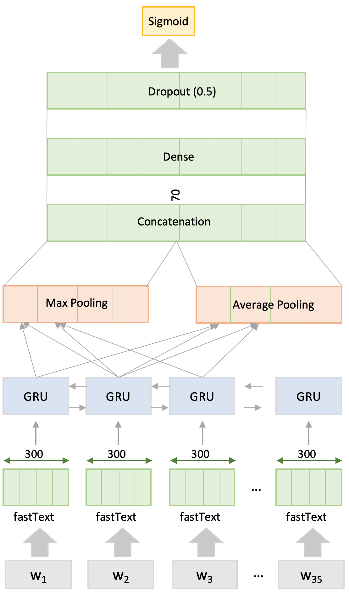

# Emotion Detection Model
Code repository for training and detcting emotions from the novel dataset using bidirectional GRU model.

## Requirements:
- Python 3.x
- Numpy 1.14.5
- Pandas 0.24.1
- Sklearn 0.19.0
- Tensorflow 2.0.0-beta0

## Code Citation:
```
@article{
  seyeditabari2019emotion,
  title={Emotion Detection in Text: Focusing on Latent Representation},
  author={Seyeditabari, Armin and Tabari, Narges and Gholizadeh, Shafie and Zadrozny, Wlodek},
  journal={arXiv preprint arXiv:1907.09369},
  year={2019}
}
```

## GRU Model:

